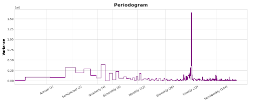
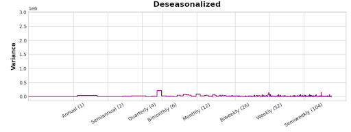

# Petalume
## Time Series Model of Candle and Home Goods Sales
Sales data from a retailer of candles and home goods over 18 months were used to explore time series model creation. This code uses time series anaylsis to identify trends and systemic patterns over time, including seasonal variations, cyclic fluctuations, as well as irregular variations. The model is also used to predict future sales.
## Periodogram
A periodogram is a tool used in time series analysis to identify the dominant frequencies or cycles within a dataset. It visualizes the strength of these cycles, revealing hidden periodic patterns by transforming the data into the frequency domain. A periodogram was created to explore the dominant cyclic patterns of the dataset. In the process of creating the periodogram, the intial dataset, a time series from 2015-2020, was truncated due to inconsistencies and non-representative data in early parts of the dataset that were not representative of the more recent sales data. The time frame used for this analyis is April 2018-March 2020. The periodogram indicated the presence of weekly, monthly, bimonthly, quarterly and annual patterns. These were used as features to build a time series model. Root Mean Squared Logarithmic Error (RSMLE) was used to assess the fit and gave a result of 1.67. A de-seasoned periodogram was created from this model, to confirm that all of the major cyclic features had been accounted for.

## Additional Model Features
Addition of features to the model was done to cover events that have both strong positive and strong negative effects on sales. The days leading up to Christmas had very high sales and were built as a feature. Christmas Day,  July 4th and other days have $0 in sales. These were incorporated as a feature called Store Closed. The dataset includes information on the type of sale, whether candles, accessories or workshops. A feature created from these was helpful for the model fit as well. Additional features that were explored but that did not result in a better fit of the model include features for the brand (there are over 100 different brands sold in the Petalume store) and a feature for the candles by item or scent. Overall the model fit improved, as assessed by the RSMLE, to 0.58.
## Future prediction
The truncated dataset described above was split into a training and a test set, with the test set being the last 15 days of the time series. The model was trained on the training data and then used on the test set for prediction of future performance. Overall, the RSMLE for the test set was 0.13, indicating a better fit for the test set than the training set. This is unexpected, as a better fit for the training data is more common, and indicates that the model is overfit to the specific dataset. This discrepancy could be due to outliers and other variation in the training set data that aren’t present in the test set. A log transform was applied to the target variable (sales) to stabilize the variance and help to reduce the effects of outliers. This resulted in an RSMLE reduction of the training set error down to 0.30, and more similar RSMLE for the test set of 0.24.

